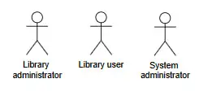
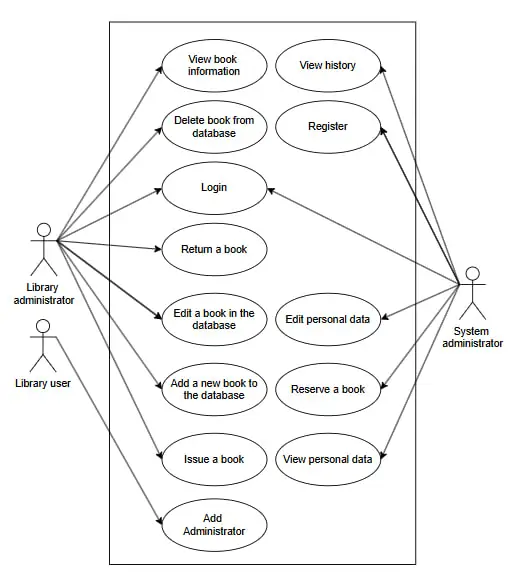
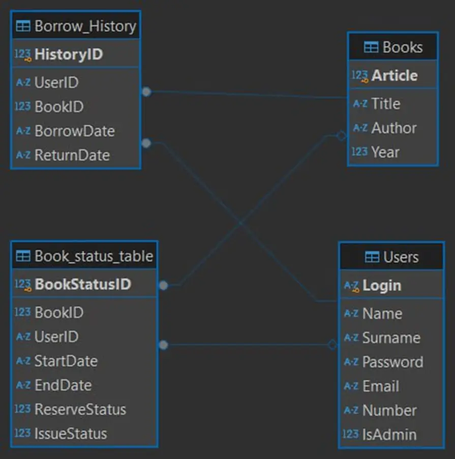
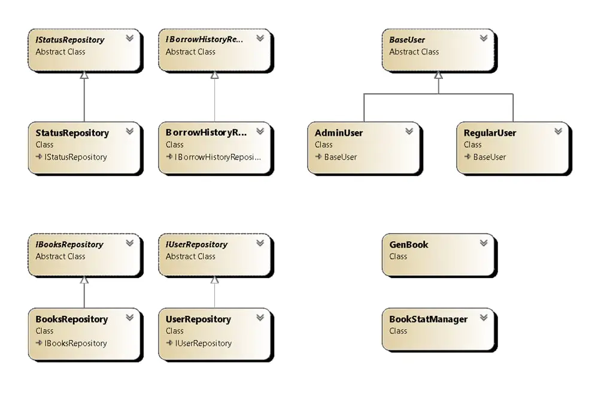

  # Library Manager v1.1.0 :orange_book:	
   :orange_book:Library Manager is implemented in C#. Created for laboratory work #8. Can be used for library management.:orange_book:  
   

## Project owners :zap:	
  + [Zavtrak Daria(SP-22)](https://github.com/Monochromka)
  + [Kychan Valentyn(SP-22)](https://github.com/WalterW16)
  + [Dobrotvor Bohdan(SP-22)](https://github.com/boddolk)  

## Identification of system actors :busts_in_silhouette:	
**Figure 1** shows the main candidates for actors in the system. 

  
  
 Figure 1. Analysis of system actors 

A brief description of the actors is presented in Table 1.

 <h3 style="text-align: right;"> Table 1. Identification of actors</h3>

| Actors                | Brief description                                                                                                                                     |
|-----------------------|-------------------------------------------------------------------------------------------------------------------------------------------------------|
| Library administrator | the first primary user who interacts directly with the administrative interface. Can perform basic manipulations with books.                          |
| Library user          | the second main user who interacts directly with the user interface. He can change his data and partially manipulate the books.                       |
| System administrator  | a user who administers the system and adds administrators.                                                                                            |

 

## Identifying use cases :detective:
The identification of use cases is shown in Table 2.
 <h3 style="text-align: right;"> Table 2. Identification of use cases</h3>

 | Main actor            | Use case                       | Definition                                                                                             |
 |-----------------------|--------------------------------|--------------------------------------------------------------------------------------------------------|
 | Library administrator | Login                          | This use case allows the administrator to log in to the system.                                        |
 | Library administrator | View book information          | This use case allows the administrator to view information about a specific book from the database.    |
 | Library administrator | Add a new book to the database | This use case allows the administrator to add a book to the database.                                  |
 | Library administrator | Edit a book in the database    | This use case allows the administrator to edit the book data.                                          |
 | Library administrator | Delete book from database      | This use case allows the administrator to delete a book from the database.                             |
 | Library administrator | Issue a book                   | This use case allows the administrator to issue a book to a library user that has been reserved.       |
 | Library administrator | Return a book                  | This use case allows the administrator to return a borrowed book to the library.                       |
 | Library user          | Login                          | This use case allows the user to log in to the system.                                                 |
 | Library user          | Register                       | This use case allows the user to log in.                                                               |
 | Library user          | View personal data             | This use case allows the user to view the personal account data.                                       |
 | Library user          | Edit personal data             | This use case allows the user to edit the personal account data.                                       |
 | Library user          | Reserve a book                 | This use case allows the user to reserve a book available in the library for a certain period of time. |
 | Library user          | View history                   | This use case allows the user to view the history of the library.                                      |
 | System administrator  | Add Administrator              | This use case allows the system administrator to add a library administrator to the database.          |

 

## Developing use case diagrams :briefcase:
All the options for use are shown in Figure 2. 

  
 
 Figure 2. Diagram of system precedents

 

## Diagram of database tables :white_check_mark:
All tables in the database are shown in Figure 3. 

  
 
 Figure 3. Diagram of database tables

 

## Class diagram of the application :ballot_box_with_check:
All clases in the application are shown in Figure 4. 

  
 
 Figure 4. Diagram of clases

 

## How to use this app :receipt:	

  ### Launching from .exe file

   1) **The application is designed for Windows, so avoid using other systems or remake the program to avoid bugs**

   2) Download *all* files and put them in a one directory;

   4) After that, go to the *"TestFiles/last_release/"** folder then double-click on *libraryMeneger.exe*;

   4) The application is running. Next, log in/register. Enjoy your use!

  ### Launching from Visual Studio

   1) **The application is designed for Windows, so avoid using other systems or remake the program to avoid bugs**

   2) Download *all* files and put them in a one directory;

   3) Open the *libraryMeneger.sln** in Visual Studio and run the project in debug mode;

   4) After that, go to the *"TestFiles/test_database/"* folder and copy *UsersAndBooks.db*;

   5) Next, follow this path: *"libraryMeneger/bin/Debug/"* and paste the previously copied file;

   6) Now your application is ready to run and work from the Visual Studio interface. Enjoy your work!

---
